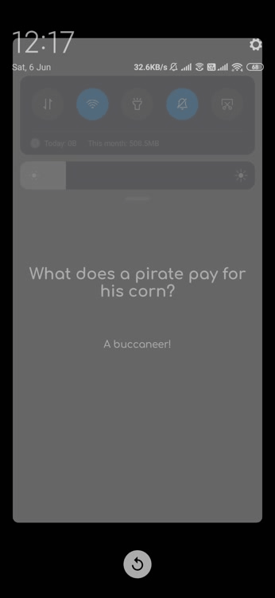

This repository contains Android project which is developed for the <a
href="https://twitter.com/hashtag/30daysofkotlin?lang=en">#30DaysOfKotlin</a>
with Google Developers (Initiative to improve your understanding of
Kotlin and apply it in real projects). Know more about it <a
href="https://eventsonair.withgoogle.com/events/kotlin">Here</a>.

# Joke

- **Joke:** This is just for fun! :) Show some random Jokes

## Preview
<table style="width:100%">
  <tr>
    <th>Joke App</th>
  </tr>
  <tr>
    <td></td>
  </tr>
</table>

## Download Joke Android App
<a href="https://github.com/iamkdblue/Joke/blob/master/art/download_app.png"></a>

## Built With 🛠
- [Kotlin](https://kotlinlang.org/) - First class and official programming language for Android development.
- [Coroutines](https://kotlinlang.org/docs/reference/coroutines-overview.html) - For asynchronous and more..
- [Android Architecture Components](https://developer.android.com/topic/libraries/architecture) - Collection of libraries that help you design robust, testable, and maintainable apps.
  - [ViewModel](https://developer.android.com/topic/libraries/architecture/viewmodel) - Stores UI-related data that isn't destroyed on UI changes.
  - [ViewBinding](https://developer.android.com/topic/libraries/view-binding) - Generates a binding class for each XML layout file present in that module and allows you to more easily write code that interacts with views.
- [Retrofit](https://square.github.io/retrofit/) - A type-safe HTTP client for Android and Java.
- [Gson](https://github.com/google/gson) - A modern JSON library for Kotlin and Java.
- [Gson Converter](https://github.com/square/retrofit/tree/master/retrofit-converters/gson) - A Converter which uses Gson for serialization to and from JSON.
- [Material Components for Android](https://github.com/material-components/material-components-android) - Modular and customizable Material Design UI components for Android


## License

```
MIT License

Copyright (c) 2020 Kuldeep Mourya

Permission is hereby granted, free of charge, to any person obtaining a copy
of this software and associated documentation files (the "Software"), to deal
in the Software without restriction, including without limitation the rights
to use, copy, modify, merge, publish, distribute, sublicense, and/or sell
copies of the Software, and to permit persons to whom the Software is
furnished to do so, subject to the following conditions:

The above copyright notice and this permission notice shall be included in all
copies or substantial portions of the Software.

THE SOFTWARE IS PROVIDED "AS IS", WITHOUT WARRANTY OF ANY KIND, EXPRESS OR
IMPLIED, INCLUDING BUT NOT LIMITED TO THE WARRANTIES OF MERCHANTABILITY,
FITNESS FOR A PARTICULAR PURPOSE AND NONINFRINGEMENT. IN NO EVENT SHALL THE
AUTHORS OR COPYRIGHT HOLDERS BE LIABLE FOR ANY CLAIM, DAMAGES OR OTHER
LIABILITY, WHETHER IN AN ACTION OF CONTRACT, TORT OR OTHERWISE, ARISING FROM,
OUT OF OR IN CONNECTION WITH THE SOFTWARE OR THE USE OR OTHER DEALINGS IN THE
SOFTWARE.
```

